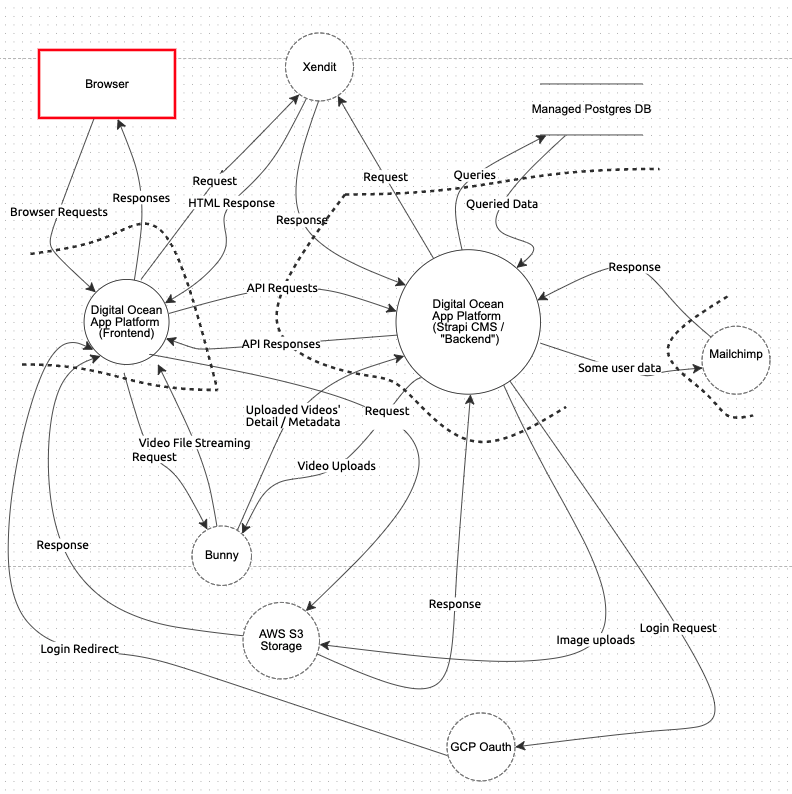

# Unbelievable.id Threat Model

## Opening the threat model

To open the threat model:

1. Log into https://www.threatdragon.com "using local session"
2. Click on **Import a threat model via JSON**.
3. Copy and paste the content of `threat_model.json` into the json field in the website
4. Click on the import button.
5. Click on the "Threat Model" diagram to see the interactive diagram (containing open and mitigated threats).

Threat model diagram:

Please follow the numbered steps above to see the interactive diagram (containing open and mitigated threats).

## Relevant Repositories

1. https://github.com/shonsirsha/unbelievable-frontend Frontend, private repository.Live URL: https://unbelievable.id
2. https://github.com/shonsirsha/unbelievable-backend Backend / CMS, private repository. Live URL: https://services.unbelievable.id/admin

## Cyber security measures already implemented

Note: Some of the measures below are already mentioned in the threat model above.

Here are the security measures that are already implemented:

### 1. Using HTTPS

We are using HTTPS issued by a third party organisation (CloudFlare) .

Below (2-5) are security headers.  
See the file here: https://github.com/shonsirsha/unbelievable-frontend/blob/main/next.config.js

### 2. CSP (Content Security Policy)

From Mozilla: Content Security Policy is an added layer of security that helps to detect and mitigate certain types of attacks, including Cross-Site Scripting (XSS) and data injection attacks.

We employ a strict CSP:

1. `frame-ancestors` to only domains that we trust and absolutely need to use
2. `styleSrc` to be `self`
3. `imgSrc` to only domains that we trust and absolutely need to use
4. `baseUri` to be `self`

### 3. HSTS

We are using HSTS (HTTP Strict Transport Security) to force redirect any user that uses http to use https. This is done to mitigate downgrade attacks.

Can be seen in the header file with the property of `forceHTTPSRedirect`

### 4. X-XSS-Protection

From [Mozilla](https://infosec.mozilla.org/guidelines/web_security#x-xss-protection): X-XSS-Protection is a feature of Internet Explorer and Chrome that stops pages from loading when they detect reflected cross-site scripting (XSS) attacks ... **they can still provide protections for users of older web browsers that don’t yet support CSP.**

Can be seen in the header file with the property of `xssProtection`: `sanitize`

### 5. Referrer Policy

Our `referrerPolicy` is set to `strict-origin-when-cross-origin`

### 6. General Error Messages

Returns a consistent and general messages for errors. For example, when a user tries to log in with an email `x@mail.com` which does not exist, and when a user tries it with `sean@mail.com` which exists but used the wrong password, both will return the same error message.

This is to prevent the attacker guessing whether an account exists or not. This could be improved by returning the error messages in a consistent amount of time to prevent the attacker enumerating which accounts exist. The last sentence however, hasn't been implemented yet.

### 7. Following Proper Password Strength Requirements

Using [OWASP's Cheatsheet for password strength](https://cheatsheetseries.owasp.org/cheatsheets/Authentication_Cheat_Sheet.html#implement-proper-password-strength-controls) as a guideline in creating our password requirements.

### 8. Secure Token for Password Reset

We are using a token to be embedded as a parameter of a "forgot password url".
We ensure that generated tokens are:

    1. Randomly generated using a cryptographically safe algorithm.
    2. Sufficiently long to protect against brute-force attacks.
    3. Stored securely.
    4. Single use and expire after an appropriate period.

### 9. Site-wide Captcha

We're using Google's re-Captcha v3 site-wide to prevent most (we hope all automated) spam and or abuse.

This is especially important for our backend endpoints that are available without authentication and that give JWT as a response (sign in, sign up) and or endpoints that are using 3rd party services and are "easily abusable" such as email sending (forgot password endpoint).

### 10. Encrypted Data

We are using bcrypt with auto-generated salt to encrypt users' passwords and some other private data before storing it in our database.

### 11. JWT Storage

We're using JWT as an authentication method.

We store our JWT as an `httpOnly` cookie (as opposed to be stored in `localStorage` or as a "normal" cookie). This makes the JWT inaccessible from the client.

If, for whatever reason, an attack such as an XSS attack ever occurs, our token won't get stolen from the attack as it's impossible for the client to access an `httpOnly` cookie.

Read more about httpOnly cookie: [OWASP article](https://owasp.org/www-community/HttpOnly).

### 12. JWT Expiration (Age)

**Per the best-practice, our JWT lives shortly.** This means, if for whatever reason our JWT gets stolen, the malicious party won't have much time until the token expires. This is in hopes to minimise the harm that can be done if a token gets stolen.

### 13. SQL Injection

We're using strapi to send queries to our database. Strapi uses bookshelf.js ORM that doesn't use raw SQL queries, and neither do we.

We however trust the ORM to do its job (not using raw sql queries), and the layer behind it (knex.js) to escape all character inputs correctly.

### 14. Database Security

Only allowing requests to be made from whitelisted addresses using database user accounts.For our case, we whitelisted our backend's address and chose a database user to be used from our backend.

This way, only our backend is able to communicate with the DB and not anyone else. Data is also encrypted in transit and at rest.

### 15. External Dependencies With Known Vulnerabilities

We are utilising Dependabot to automatically notifies us and creates a PR for dependency updates when any of our dependency that we are using have known vulnerability(ies).
